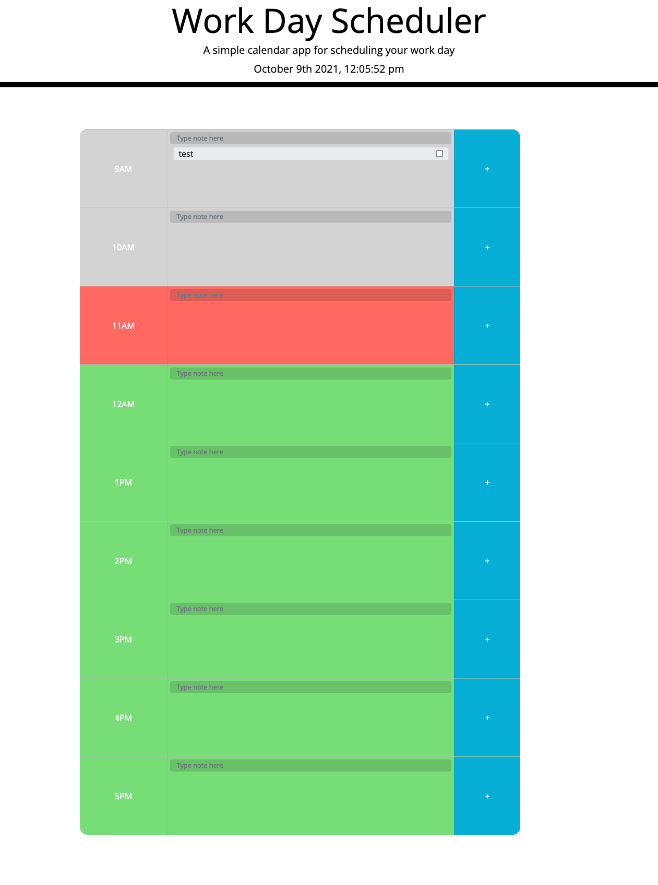

# Homework Assignment - Week 5

## Work Day Scheduler

- [Description](#Description)
- [Assets](#Assets)
- [Installation](#To-edit-this-projects-repository)
- [Licensing](#License)

## Description

This website contains a basic work day scheduler. It shows hourly sections from 9am - 5pm and you can add notes to each time to work like a to do list. Those notes can then be checked and deleted if they have been completed. This websites uses JQuery, Bootstrap, HTML and CSS to operate, giving a clean design and fast responses. 

## Assets

You can find this page live at: https://jakecolledge97.github.io/work-day-scheduler/

Here is a screenshot of the full page.




## To edit this projects repository

1. Open an empty project in VS code.
2. Open an integrated terminal and copy and paste the following to clone the repo:
```
git clone git@github.com:jakecolledge97/work-day-scheduler.git
```
(this is found on my github page in the password generator repository https://github.com/jakecolledge97/work-day-scheduler .)

3. right click in the open index.html document and select open in default browser.


## License 

Copyright (c) 2021 Jake Colledge

Permission is hereby granted, free of charge, to any person obtaining a copy
of this software and associated documentation files (the "Software"), to deal
in the Software without restriction, including without limitation the rights
to use, copy, modify, merge, publish, distribute, sublicense, and/or sell
copies of the Software, and to permit persons to whom the Software is
furnished to do so, subject to the following conditions:

The above copyright notice and this permission notice shall be included in all
copies or substantial portions of the Software.

THE SOFTWARE IS PROVIDED "AS IS", WITHOUT WARRANTY OF ANY KIND, EXPRESS OR
IMPLIED, INCLUDING BUT NOT LIMITED TO THE WARRANTIES OF MERCHANTABILITY,
FITNESS FOR A PARTICULAR PURPOSE AND NONINFRINGEMENT. IN NO EVENT SHALL THE
AUTHORS OR COPYRIGHT HOLDERS BE LIABLE FOR ANY CLAIM, DAMAGES OR OTHER
LIABILITY, WHETHER IN AN ACTION OF CONTRACT, TORT OR OTHERWISE, ARISING FROM,
OUT OF OR IN CONNECTION WITH THE SOFTWARE OR THE USE OR OTHER DEALINGS IN THE
SOFTWARE.